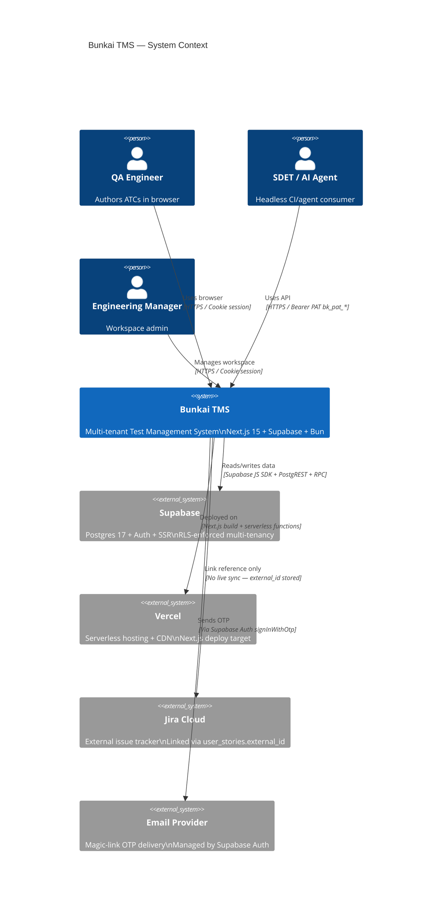

# Architecture Specs — upex-bunkai-tms

> Generated: 2026-06-08 | Phase: Project Discovery Phase 2 — Architecture
> Sources: middleware.ts, lib/api/*, app/api/v1/*, supabase/migrations/0001–0012, lib/openapi/registry.ts, app/qa/qa-config.ts, next.config.ts

---

## System Overview



Source: app/qa/qa-config.ts, DESIGN.md §1, middleware.ts, lib/supabase/*

---

## Tech Stack

| Layer | Technology | Version | Notes |
|-------|-----------|---------|-------|
| Runtime | Bun | >= 1.0.0 | Package manager + script runner |
| Framework | Next.js App Router | ^15 | SSR + API Routes + Server Actions |
| Language | TypeScript | ^5.9.3 | Strict mode |
| React | React | ^19 | Server + Client components |
| Styling | Tailwind CSS | ^3.4 | CSS custom properties mapped to semantic tokens |
| Component library | Radix UI + shadcn/ui | Multiple | Radix primitives: Dialog, DropdownMenu, Tabs, Tooltip |
| Icons | Lucide React | ^1.16.0 | 14px default inline, 16px nav |
| Code editor | Monaco Editor (React) | ^4.7.0 | ATC step/assertion authoring |
| Table | TanStack Table | ^8.21.3 | ATC list view |
| Toast | Sonner | ^2.0.7 | Notifications |
| Command palette | cmdk | ^1.1.1 | `Cmd/Ctrl+K` global navigation |
| Database | Supabase PostgreSQL 17 | — | Multi-tenant, RLS on all tables |
| Auth (browser) | Supabase SSR + cookie | ^0.10.3 | `sb-<project-ref>-auth-token` cookie |
| Auth (headless) | Bearer PAT `bk_pat_*` | Custom | `lib/api/pat.ts` + `lib/api/middleware/bearer.ts` |
| API spec | OpenAPI via zod-to-openapi | ^8.5.0 | Generated to `public/openapi.json` |
| API docs UI | Scalar | ^0.9.38 | Served at `/api/docs` |
| Validation | Zod | ^4.4.3 | All API request bodies |
| Linter | ESLint (antfu config) | ^9.28.0 | |
| Git hooks | Husky + lint-staged | ^9.1.7 | Pre-commit validation |
| DB browser (MCP) | DBHub | bytebase | `dbhub.toml` config at root |

Source: package.json (via project-config.md), DESIGN.md §9

---

## Database Schema

```mermaid
erDiagram
  workspaces {
    uuid id PK
    text slug UK
    text name
    uuid owner_user_id FK
    text plan
    timestamptz created_at
  }

  workspace_members {
    uuid workspace_id FK
    uuid user_id FK
    text role
    text status
    timestamptz joined_at
  }

  projects {
    uuid id PK
    uuid workspace_id FK
    text slug
    text name
    text description
    timestamptz created_at
  }

  modules {
    uuid id PK
    uuid project_id FK
    uuid parent_module_id FK
    text path
    text name
    int position
    timestamptz created_at
  }

  user_stories {
    uuid id PK
    uuid module_id FK
    text title
    text description
    text external_id
    text external_url
    timestamptz created_at
  }

  acceptance_criteria {
    uuid id PK
    uuid user_story_id FK
    text title
    text description
    int position
    timestamptz created_at
  }

  atcs {
    uuid id PK
    uuid project_id FK
    uuid module_id FK
    uuid user_story_id FK
    text slug UK
    text title
    text layer
    int version
    text status
    text[] tags
    tsvector tsv
    timestamptz created_at
    timestamptz updated_at
  }

  atc_steps {
    uuid id PK
    uuid atc_id FK
    int position
    text content
    text input_data
    text expected
  }

  atc_assertions {
    uuid id PK
    uuid atc_id FK
    int position
    text content
  }

  atc_acceptance_criteria {
    uuid atc_id FK
    uuid acceptance_criterion_id FK
  }

  access_tokens {
    uuid id PK
    uuid user_id FK
    uuid workspace_id FK
    text name
    text token_prefix
    text[] scopes
    timestamptz expires_at
    timestamptz revoked_at
    timestamptz last_used_at
    timestamptz created_at
  }

  access_token_secrets {
    uuid token_id PK FK
    text hash
  }

  workspace_invites {
    uuid id PK
    uuid workspace_id FK
    text email
    text role
    uuid invited_by_user_id FK
    timestamptz created_at
    timestamptz expires_at
    timestamptz accepted_at
    uuid accepted_by_user_id FK
    timestamptz revoked_at
  }

  workspace_invite_secrets {
    uuid invite_id PK FK
    text token_hash
  }

  idempotency_keys {
    uuid id PK
    uuid user_id FK
    text endpoint
    text key
    text status
    jsonb response_snapshot
    timestamptz created_at
    timestamptz expires_at
  }

  activity_log {
    uuid id PK
    uuid workspace_id FK
    uuid actor_user_id FK
    text entity_type
    uuid entity_id
    text action
    jsonb payload
    timestamptz created_at
  }

  feature_flags {
    uuid id PK
    text key
    text scope
    uuid workspace_id FK
    boolean enabled
    jsonb payload
    timestamptz created_at
    timestamptz updated_at
  }

  user_view_state {
    uuid id PK
    uuid user_id FK
    uuid project_id FK
    text view_kind
    jsonb state
    timestamptz updated_at
  }

  magic_link_tokens {
    uuid id PK
    text email
    text user_agent
    timestamptz created_at
  }

  magic_link_token_secrets {
    uuid magic_link_token_id PK FK
    text token_hash
    text ip_hash
  }

  workspaces ||--o{ workspace_members : "has members"
  workspaces ||--o{ projects : "contains"
  workspaces ||--o{ access_tokens : "scoped to"
  workspaces ||--o{ workspace_invites : "issues"
  workspaces ||--o{ activity_log : "audited by"
  workspaces ||--o{ feature_flags : "configures"
  projects ||--o{ modules : "organizes"
  modules ||--o{ modules : "parent of (self-ref)"
  modules ||--o{ user_stories : "contains"
  user_stories ||--o{ acceptance_criteria : "has criteria"
  user_stories ||--o{ atcs : "tested by"
  projects ||--o{ atcs : "contains"
  modules ||--o{ atcs : "scopes"
  atcs ||--o{ atc_steps : "has steps"
  atcs ||--o{ atc_assertions : "has assertions"
  atcs ||--o{ atc_acceptance_criteria : "bound to"
  acceptance_criteria ||--o{ atc_acceptance_criteria : "bound in"
  access_tokens ||--|| access_token_secrets : "hashed in"
  workspace_invites ||--|| workspace_invite_secrets : "hashed in"
  magic_link_tokens ||--|| magic_link_token_secrets : "hashed in"
```

Source: supabase/migrations/0001_tenancy.sql through 0012_drop_legacy_token_hashes.sql

---

## Auth Model

### Flow 1 — Cookie Session (Browser / Magic Link)

```
User → POST /api/v1/auth/magic-link {email}
         |
         → supabase.auth.signInWithOtp(email, { emailRedirectTo: /auth/callback?next=... })
         |
         → Supabase sends OTP email
         |
User → clicks link → /auth/callback?next=/projects
         |
         → Supabase OTP exchange → sets sb-<project-ref>-auth-token cookie
         |
         → middleware.ts: createServerClient → supabase.auth.getUser() on every request
         |
         → if !user && isProtected(path) → redirect /login?next={path}
```

Protected route prefixes: `/projects`, `/onboarding`
Public route prefixes: `/login`, `/auth`, `/api/auth`

Source: middleware.ts, app/api/v1/auth/magic-link/route.ts

### Flow 2 — Bearer PAT (Headless / CLI / AI Agent)

```
Client → POST /api/v1/auth/signup OR /api/v1/auth/signin {email, password, pat_scopes}
          |
          → Admin client creates/signs in user
          → mintPat() → inserts access_tokens row + access_token_secrets row (SHA-256 hash)
          → Returns: { session, pat: { token: "bk_pat_<prefix>.<secret>" } }
          |
Client stores token. Subsequent requests:
          |
Client → Any /api/v1/* route with "Authorization: Bearer bk_pat_<prefix>.<secret>"
          |
          → requireAuth() detects Bearer header → requireBearerToken()
          → Parse token_prefix (first 12 chars)
          → SELECT from access_tokens WHERE token_prefix = ? (O(1) indexed lookup)
          → constant-time SHA-256 compare against access_token_secrets.hash
          → Check: revoked_at IS NULL, expires_at > now()
          → Returns: { userId, scopes, tokenId, workspaceId }
```

Token format: `bk_pat_` family prefix + 12-char prefix + `.` + secret remainder (256-bit random)
Scopes: `atc:read` | `atc:write` | `run:execute` | `workspace:admin`

Source: lib/api/pat.ts, lib/api/middleware/bearer.ts, lib/api/auth.ts, migrations/0008_access_tokens.sql

### Flow 3 — Magic Link Token Audit

Each magic-link issuance creates a row in `magic_link_tokens` (email, user_agent) + `magic_link_token_secrets` (SHA-256 of a synthetic token + IP hash). This is a best-effort audit trail for rate-limiting signals; it does not gate the auth flow.

Source: app/api/v1/auth/magic-link/route.ts, migrations/0009_cross_cutting.sql, migrations/0011_split_token_secrets.sql

---

## RLS Strategy

All 14+ tables have RLS enabled. The pattern is consistent throughout the schema:

| Operation | Who can perform |
|-----------|----------------|
| SELECT | Any active workspace member (via `bunkai_is_workspace_member`) |
| INSERT / UPDATE / DELETE | Active member with role `member`, `admin`, or `owner` (via `bunkai_can_write_workspace`) |
| Workspace UPDATE | Owner only (via `bunkai_is_workspace_owner`) |
| Workspace DELETE | Owner only |
| workspace_members MANAGE | Admin or Owner (via `bunkai_is_workspace_admin`) |

**Recursion prevention**: The `SECURITY DEFINER` helper functions (`bunkai_is_workspace_member`, `bunkai_can_write_workspace`, `bunkai_is_workspace_admin`, `bunkai_is_workspace_owner`) bypass RLS internally, preventing the 42P17 infinite-recursion error that would occur if policies queried `workspace_members` directly while evaluating a `workspace_members` policy.

**Secret table isolation**: Three sibling tables (`access_token_secrets`, `workspace_invite_secrets`, `magic_link_token_secrets`) are explicitly revoked from `qa_inspector_ro`/`qa_inspector_rw` roles. Only `service_role` can read them.

**Admin client bypasses**: `createAdminClient()` uses `SUPABASE_SECRET_KEY` which bypasses RLS. Used only in routes that need to write to secret-adjacent tables or resolve cross-user data after explicit auth checks at the application layer.

Source: migrations/0005_rls_helpers.sql, migrations/0011_split_token_secrets.sql, lib/supabase/admin.ts

---

## External Services

| Service | Purpose | Integration Mechanism |
|---------|---------|----------------------|
| Supabase (Postgres 17) | Primary data store + Auth + SSR | `@supabase/supabase-js` + `@supabase/ssr` |
| Supabase Auth | Magic-link OTP + user management | `supabase.auth.*` SDK methods |
| Vercel | Serverless hosting + CDN | Next.js build target; env vars via `NEXT_PUBLIC_APP_URL` |
| Email Provider | OTP delivery | Managed by Supabase Auth (provider not configured in app code) |
| Jira Cloud | External issue tracker | Reference only — `user_stories.external_id` / `external_url` fields; no live API calls |
| DBHub | DB introspection MCP | `dbhub.toml` at root; `qa_inspector_ro/rw` roles |
| OpenAPI MCP | API exploration | `bunx @ivotoby/openapi-mcp-server` with `GET /api/openapi` |
| Playwright MCP | Browser automation | Documented in `/qa` guide; QA repo consumes |
| Atlassian MCP | Jira issue management | `ATLASSIAN_*` env vars; consumed by QA repo |
| Tavily MCP | Web search | QA repo; not used in target app |
| n8n | Workflow automation | QA repo; not used in target app |

Source: app/qa/qa-config.ts, .env.example (via project-config.md), package.json

---

## API Contract

| Aspect | Detail |
|--------|--------|
| Base URL | `/api/v1` |
| Spec format | OpenAPI 3.x (JSON) |
| Spec generation | `@asteasolutions/zod-to-openapi` → `public/openapi.json` (via `bun run openapi:gen`) |
| Spec endpoint | `GET /api/openapi` — static, force-cached 300s |
| Docs UI | Scalar — `GET /api/docs` |
| Error envelope | `{ error: { code, message, details?, request_id? } }` — all error codes in `lib/api/error-envelope.ts` |
| Request tracing | `x-request-id` header injected on all responses via `lib/api/handler.ts` `withApiHandler` |
| Idempotency | `idempotency_keys` table — 24h TTL on `(user_id, endpoint, key)` |

### Complete API Endpoint Catalog

| Method | Path | Auth | Status Codes |
|--------|------|------|-------------|
| GET | `/api/v1/health` | None | 200 |
| GET | `/api/v1/me` | Cookie or Bearer | 200, 401 |
| PUT | `/api/v1/me/active-workspace` | Cookie or Bearer | 200, 401 |
| GET | `/api/v1/workspaces` | Cookie or Bearer | 200, 401 |
| POST | `/api/v1/workspaces` | Cookie | 201, 400, 401, 409, 422 |
| GET | `/api/v1/workspaces/[id]` | Cookie or Bearer | 200, 400, 401, 404 |
| PATCH | `/api/v1/workspaces/[id]` | Cookie (owner) | 200, 400, 401, 403 |
| GET | `/api/v1/workspaces/[id]/invites` | Cookie (admin+) | 200, 400, 401 |
| POST | `/api/v1/workspaces/[id]/invites` | Cookie (admin+) | 201, 400, 401, 403, 422 |
| DELETE/PATCH | `/api/v1/workspaces/[id]/invites/[inviteId]` | Cookie (admin+) | 200, 400, 401, 403, 404 |
| POST | `/api/v1/invites/accept` | Cookie | 200, 400, 401, 403, 404, 409 |
| GET | `/api/v1/tokens` | Cookie or Bearer | 200, 401 |
| POST | `/api/v1/tokens` | Cookie | 201, 400, 401, 422 |
| DELETE | `/api/v1/tokens/[id]` | Cookie or Bearer | 200, 400, 401, 403, 404 |
| POST | `/api/v1/auth/magic-link` | None | 200, 400, 422, 429, 502 |
| POST | `/api/v1/auth/signup` | None | 201, 400, 409, 422, 502 |
| POST | `/api/v1/auth/signin` | None | 200, 400, 401, 422 |
| GET | `/api/openapi` | None | 200 |
| GET | `/api/docs` | None | 200 |

Source: app/api/v1/** route files, lib/api/error-envelope.ts, app/api/openapi/route.ts

---

## Security Model

### Defense Layers

```
+----------------------------------------------+
| Layer 1: Next.js Middleware                   |
|   - Supabase session validation on all        |
|     requests to /projects/*, /onboarding      |
|   - Redirect unauthenticated → /login         |
+----------------------------------------------+
         |
+----------------------------------------------+
| Layer 2: API Route Auth                       |
|   - requireAuth() → cookie OR bearer          |
|   - Bearer: prefix lookup + SHA-256 compare   |
|   - requireScopeOrCookie() for write ops      |
+----------------------------------------------+
         |
+----------------------------------------------+
| Layer 3: Postgres RLS                         |
|   - All 14 tables have RLS enabled            |
|   - auth.uid() == workspace_members.user_id   |
|   - SECURITY DEFINER helpers prevent recursion|
+----------------------------------------------+
         |
+----------------------------------------------+
| Layer 4: Admin Client Isolation               |
|   - service_role used ONLY after app-layer    |
|     auth is already verified                  |
|   - Secret tables never exposed to QA roles   |
+----------------------------------------------+
```

### Token Security

- PAT secret: 256-bit random, base64url-encoded. Only SHA-256 stored in DB.
- Token prefix: first 12 chars, used for O(1) indexed lookup (avoids full-table scan).
- Family prefix `bk_pat_`: enables GitHub/GitGuardian secret-scanning to auto-detect leaked tokens.
- Invite tokens: same pattern — raw token shown once, SHA-256 stored in sibling table.
- Revocation: soft-delete via `revoked_at` timestamp — no physical DELETE. Token still exists for audit purposes.
- Constant-time comparison: prevents timing-based oracle attacks.

Source: lib/api/pat.ts, lib/api/middleware/bearer.ts, app/api/v1/tokens/route.ts, migrations/0011_split_token_secrets.sql

---

## Discovery Gaps

- [ ] `auth/callback` route — the OTP exchange endpoint (`/auth/callback`) must exist but was not found in the `find` output. Likely at `app/auth/callback/route.ts` or `app/(auth)/callback/route.ts`. Needs verification.
- [ ] `openapi:gen` script — `app/api/openapi/route.ts` reads `public/openapi.json` from disk (pre-built). The generation script (`bun run openapi:gen`) exists in package.json per the comment, but `lib/openapi/registry.ts` was not fully explored. The actual spec content depends on which routes have `route.openapi.ts` companions.
- [ ] `PUT /api/v1/me/active-workspace` implementation — the route file exists but was not read. Behavior (cookie write? DB field?) is unverified.
- [ ] `DELETE /api/v1/workspaces/[id]/invites/[inviteId]` — the route file exists but was not fully read. Revocation mechanism assumed to be `revoked_at` stamp.
- [ ] `qa_inspector_ro` / `qa_inspector_rw` CREATE ROLE DDL — referenced in migration 0011 REVOKE statements but the CREATE ROLE DDL is not in any migration file. Provisioned out-of-band via Supabase Studio.
- [ ] Staging / production Supabase project reference — cookie name contains `<project-ref>`, needed for test fixture configuration.
